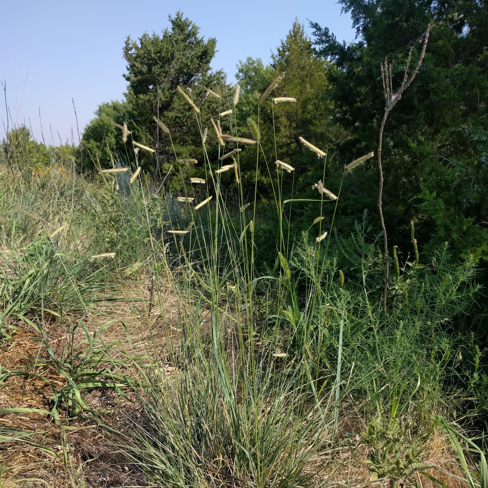
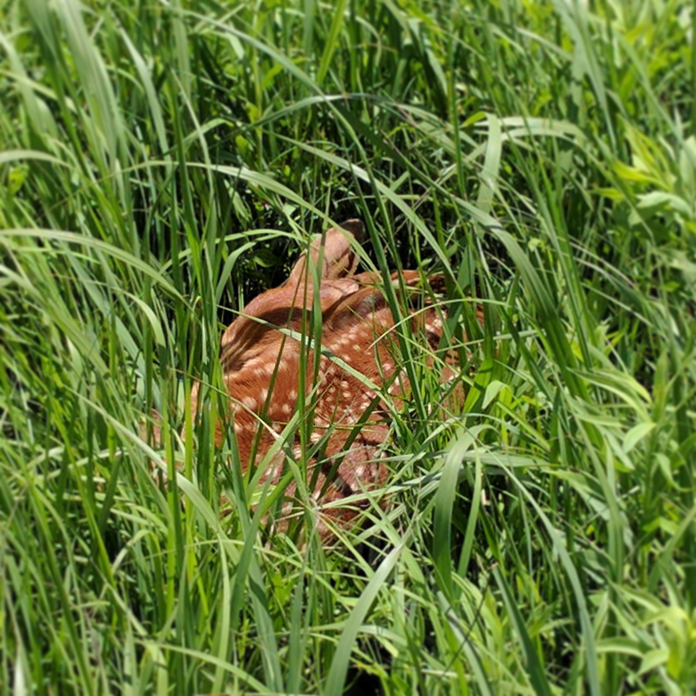

 

 
<h2><a href="https://github.com/avahoffman/blue-grama-diversity">Intraspecific Diversity in Blue Grama Grass</a></h2>

*Bouteloua gracilis* (blue grama grass) is one of our most important native prairie plants. This grass is widespread throughout semi-arid grasslands, expertly tolerates drought, and is valuable food for livestock. I study how blue grama varies across its range, using greenhouse experiments and genetic sequencing tools, and how such variation cascades to affect ecosystem function.

 

 
<h2><a href="">Plasticity Function Diversity</a></h2>

Phenotypic plasticity is the ability to change phenotype under different conditions. For example, functional traits (such as leaf area or root structure) might be lower under droughted conditions. How a trait tracks over conditions represents a mathematical function. These functions can reveal diversity within species, allowing them to fill greater niche space and potentially evolve. I use *Andropogon gerardii* (big bluestem grass) to understand how plasticity functions can vary within species.
