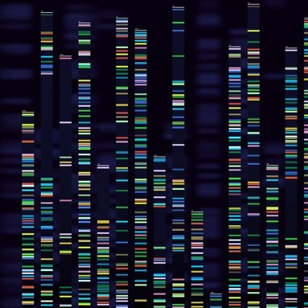
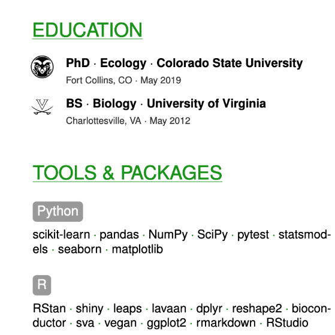

 

 
<h2><a href="https://www.ncbi.nlm.nih.gov/bioproject/PRJNA612011">Blue grama genome sequences</a></h2>

*Bouteloua gracilis* (blue grama grass) is genetically diverse, even as small spatial scales. I used thousands of small pieces of DNA called "SNPs" to compare these grasses across populations all over the western US.

<h2><a href="https://datadryad.org/stash/dataset/doi:10.5061/dryad.5bk4c">Transcriptomes</a></h2>

Indiangrass and big bluestem coexist in the tallgrass prairie of Eastern Kansas, USA and despite being functionally similar, they adopt different gene expression strategies for coping with climate extremes. As part of comparative work in the tallgrass prairie, I quantified gene response strategies in dominant prairie grasses, showing that *Sorghastrum nutans* (indiangrass) shuts down under drought stress, but *Andropogon gerardii* (big bluestem) powers through. The transcriptomes are a great starting point for anyone doing gene expression work in these important plants.

<h2><a href="https://figshare.com/articles/Climate_extremes_tallgrass_prairie_raw_microarray/5627425">Microarrays</a></h2>

Indiangrass and big bluestem adopt different gene expression strategies for coping with climate extremes, including heat waves, as shown with microarray data.

 

 <h2><a href="https://github.com/avahoffman/CV-and-resumes">LaTeX Resume Templates</a></h2>

Did you know recruiters spend as little as [six seconds](https://www.glassdoor.com/blog/scanning-resumes/) looking at your resume? If you know a little code, you can make that recruiter take a second look. Please feel free to use and modify my templates.
